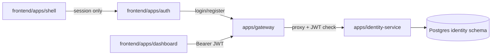

# Service-based architecture — Concept

This monorepo proves **service-based architecture on both sides**: NestJS services behind a gateway, and independent Next.js apps that share one session and call that gateway.

---

## The problem

Products often split the backend into services but keep a single giant frontend. That creates mismatched deploy units: one UI release for every backend change, and one team blocking another.

This POC mirrors service boundaries in the UI.

---

## The idea in one sentence

**Backend services + federated frontend apps, joined by one gateway and one auth cookie.**

```text
Browser
  ├─ auth        :3002   login / register / session cookie
  ├─ shell       :3003   home
  └─ dashboard   :3004   workspace (users)

All frontends → gateway :3000 → identity-service :3001 → Postgres
```

---

## Architecture



### Backend (`apps/`, `libs/`)

| Piece | Role |
|-------|------|
| `gateway` | Public HTTP entry, JWT validation, path-based proxy |
| `identity-service` | Register, login, users, JWT issuance |
| `libs/common` | Bootstrap, filters, pagination helpers |
| `libs/database` | Shared Postgres helpers |

### Frontend (`frontend/`)

| Piece | Role |
|-------|------|
| `apps/auth` | Issues/clears the shared NextAuth cookie |
| `apps/shell` | Post-login home |
| `apps/dashboard` | Profile + paginated users |
| `packages/*` | Shared UI, auth, api-client, i18n, types |

---

## Auth model

APIs use **Bearer JWTs**. The browser uses a **shared NextAuth cookie**.

1. Auth app calls `POST /api/identity/auth/login`
2. Gateway/identity returns `{ accessToken, user }`
3. NextAuth stores them in an httpOnly cookie (same `AUTH_SECRET` on all apps)
4. Dashboard reads the session and sends `Authorization: Bearer {accessToken}` to the gateway
5. Logout always clears the cookie on the auth app

Localhost: cookies are shared across ports automatically.  
Production: set `AUTH_COOKIE_DOMAIN=.example.com` for subdomains.

Full sequence and package map: [frontend/CONCEPT.md](./frontend/CONCEPT.md).

---

## Port map

| Service | Port |
|---------|------|
| Gateway | 3000 |
| Identity | 3001 |
| Auth app | 3002 |
| Shell app | 3003 |
| Dashboard app | 3004 |

---

## What this POC proves

- Independent NestJS services behind one gateway
- Independent Next.js apps with shared packages
- One login unlocks shell + dashboard
- Real identity APIs (not mocks)

## Out of scope (for now)

Tenants, DMS tree/levels/files, forgot/reset password, Module Federation runtime, production subdomain DNS.

Add those as new Nest services + optional new frontend apps without collapsing the UI into one monolith again.

---

## How to run both

```bash
# terminal 1 — backend (repo root)
pnpm install && pnpm dev

# terminal 2 — frontend
cd frontend && pnpm install && pnpm dev
```

Then open http://localhost:3002/en/login.
