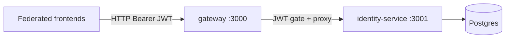
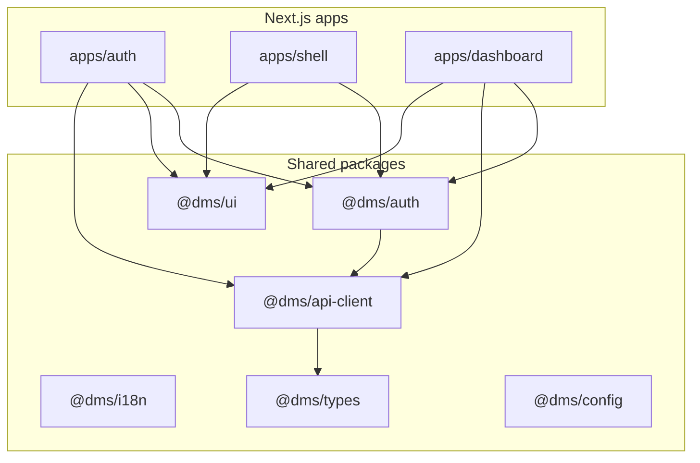
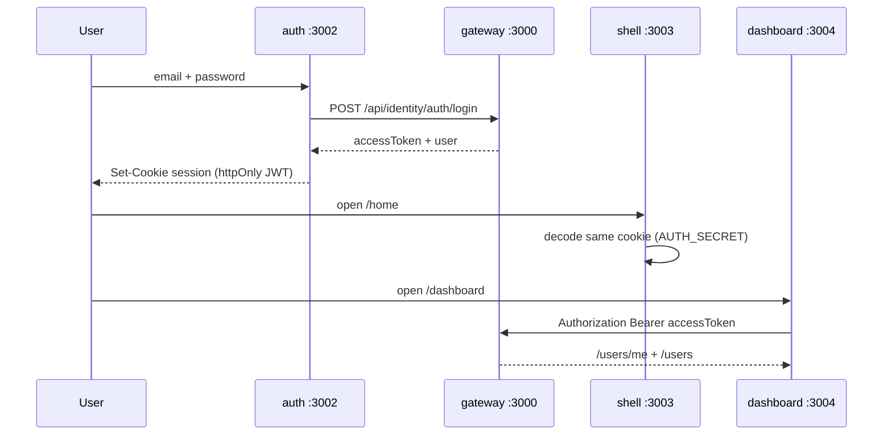

# Federated Frontend POC — Concept

This document explains **why** the frontend is split into multiple apps, how it pairs with the NestJS service-based backend, and what this POC deliberately proves (and does not prove).

---

## The problem

A typical DMS / SaaS product grows into one large Next.js app:

- Auth screens, marketing/home shell, and heavy workspace UI share one deploy unit
- Teams block each other on releases
- Scaling one feature means rebuilding everything
- The backend may already be split into services (gateway + identity + …), but the UI stays a monolith

This POC mirrors the **backend service boundary** on the frontend: independent Next.js apps, shared packages, one session.

---

## The idea in one sentence

**Three frontend apps on three origins share one auth cookie and talk only to the API gateway** — the same way microservices share one edge and stay independently deployable.

```text
Browser
  ├─ auth.example.com        → apps/auth        (login / register / cookie)
  ├─ app.example.com         → apps/shell       (home / landing)
  └─ dashboard.example.com   → apps/dashboard   (workspace / users)

All of them → api.example.com → NestJS gateway → identity-service (and future services)
```

Locally we use ports instead of subdomains:

| Role | Local URL | Port |
|------|-----------|------|
| Gateway (API) | http://localhost:3000 | 3000 |
| Identity service | http://localhost:3001 | 3001 |
| Auth app | http://localhost:3002 | 3002 |
| Shell app | http://localhost:3003 | 3003 |
| Dashboard app | http://localhost:3004 | 3004 |

---

## Architecture

### Backend (already in `service-based-archtecture-template`)



- **Gateway** is the only public API entry: `/api/identity/*`
- Public: `POST /auth/login`, `POST /auth/register`
- Protected: `/users`, `/users/me`, …
- Tokens are **Bearer JWTs** (`accessToken`), not cookies, at the API layer

### Frontend (this repo)



| Package | Responsibility |
|---------|----------------|
| `@dms/auth` | NextAuth config, session types, middleware factory, token → axios wiring |
| `@dms/api-client` | Axios client pointed at the gateway + identity helpers |
| `@dms/ui` | Design system tokens + shadcn primitives |
| `@dms/i18n` | next-intl routing + en/ar messages |
| `@dms/types` | DTOs mirrored from identity (`User`, `AuthResponse`, pagination) |
| `@dms/config` | Shared tsconfig / postcss |

Apps stay thin: routes, layouts, and feature UI only.

---

## Auth model (the hard part)

APIs stay Bearer-token based. **Browser session** is a shared NextAuth JWT cookie.



Rules that make federation work:

1. **Same `AUTH_SECRET`** in all three apps (encrypt/decrypt the session cookie)
2. **Auth app issues/clears the cookie**; shell and dashboard mostly *read* it
3. **Axios** attaches `Authorization: Bearer {accessToken}` from the session
4. Localhost: host-only cookies are shared across ports (no hosts file)
5. Production: set `AUTH_COOKIE_DOMAIN=.example.com` for subdomain sharing
6. Unauthenticated shell/dashboard → redirect to auth login with `callbackUrl`
7. Logout always hits the **auth** app so the cookie is cleared once

---

## What this POC proves

- Independent Next.js apps can ship on different ports/origins
- Shared packages replace copy-paste across apps
- One login unlocks shell + dashboard without re-auth
- Real calls to the NestJS gateway identity APIs (not mocks)
- i18n (en/ar) and a shared design system across apps

## What it deliberately skips

| Skipped | Why |
|---------|-----|
| Tenants / levels / tree / files | Not on this NestJS backend yet |
| Forgot / reset password | Identity service has no endpoints |
| Module Federation runtime | Separate Next apps + shared packages is enough for the architecture POC |
| Production subdomain deploy | Env hooks exist (`AUTH_COOKIE_DOMAIN`); not wired to DNS/CDN here |

Those can be added later as more Nest services appear (`/api/dms/...`, etc.) without collapsing the UI back into one app.

---

## How to run

**Terminal 1 — backend**

```bash
cd service-based-archtecture-template
pnpm install
pnpm dev
# gateway :3000, identity :3001
```

**Terminal 2 — frontend**

```bash
cd dms-federated-frontend
pnpm install
cp .env.example apps/auth/.env.local   # same values for shell + dashboard
pnpm dev
# auth :3002, shell :3003, dashboard :3004
```

Open http://localhost:3002/en/login → register/login → shell home → dashboard users.

---

## Design principles going forward

1. **New backend service** → new gateway prefix → optional new frontend app (or package hooks into an existing app)
2. **Shared contracts** live in `@dms/types` (and eventually OpenAPI codegen)
3. **Auth stays centralized**; feature apps never become alternate login issuers
4. Keep apps **thin**; put reusable UI and data access in packages
5. Prefer **deploy independence** over sharing a single Next.js process

---

## Mental model

| Backend | Frontend analogue |
|---------|-------------------|
| `gateway` | Browser edge + shared cookie domain |
| `identity-service` | `apps/auth` + identity API usage |
| Future `dms-service` | `apps/dashboard` (or a new app) |
| `libs/common` | `packages/*` |

The POC is not “micro-frontends for their own sake.” It is **service-based architecture, end to end**: split where teams and deploy units need to split, share what must stay consistent (auth, types, design, i18n).
